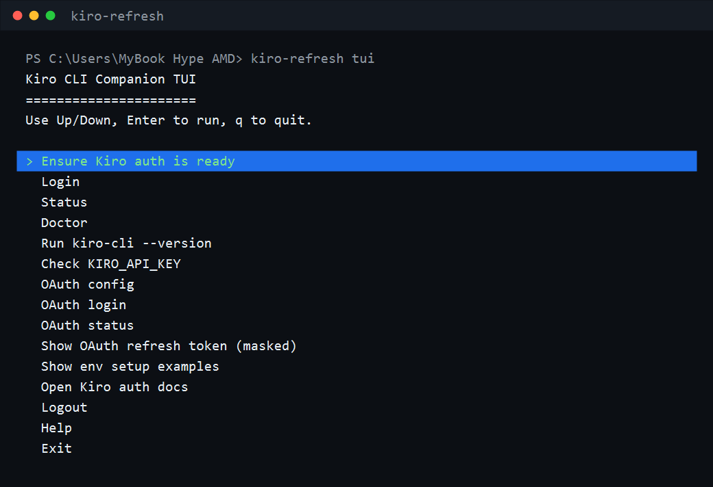
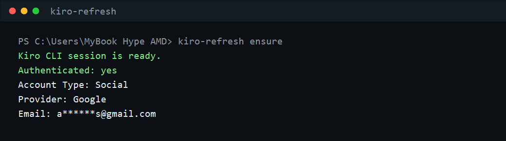

<p align="center">
  
</p>

<pre align="center">
 _  ___                 _         _   _       _                 
| |/ (_)_ __ ___       / \  _   _| |_| |__   | |__   ___ _ __  
| ' /| | '__/ _ \     / _ \| | | | __| '_ \  | '_ \ / _ \ '__| 
| . \| | | | (_) |   / ___ \ |_| | |_| | | | | | | |  __/ |    
|_|\_\_|_|  \___/   /_/   \_\__,_|\__|_| |_| |_| |_|\___|_|    
</pre>

<p align="center">
  <strong>Kiro CLI Companion</strong><br />
  Beginner-friendly TUI, auth doctor, and command wrapper for Kiro CLI.
</p>

# Kiro CLI Companion

`kiro-refresh` adalah companion tool untuk orang yang ingin memakai Kiro CLI tanpa bingung urusan login, status akun, setup API key, dan command terminal.

Fokus project ini sekarang jelas: **membuat Kiro CLI lebih mudah dipakai lewat TUI dan command helper**, terutama untuk user awam yang belum nyaman dengan terminal.

> Unofficial helper. Kiro logo is loaded from the official [kirodotdev/Kiro](https://github.com/kirodotdev/Kiro) repository asset.

## Arah Project

Project ini adalah **Kiro CLI Companion**, bukan refresh-token extractor.

Masalah yang diselesaikan:

- User bingung apakah Kiro CLI sudah login atau belum.
- User bingung command pertama apa yang harus dijalankan.
- User ingin menu terminal sederhana, bukan menghafal banyak command.
- User ingin menjalankan `kiro-cli` lewat wrapper yang mengecek auth dulu.
- User butuh demo OAuth resmi yang bisa menerima dan menampilkan refresh token dari token endpoint.
- User ingin setup API key untuk automation tanpa mencetak secret ke terminal.

Target user:

- Pengguna Kiro CLI yang masih baru.
- Pengguna Windows/PowerShell yang ingin workflow copy-paste.
- Pengguna yang ingin TUI sederhana untuk login, status, doctor, dan run command.

Yang sengaja bukan tujuan:

- Tidak mengambil refresh token mentah.
- Tidak membaca cookie, localStorage, profile browser, atau database internal Kiro.
- Refresh token hanya bisa ditampilkan jika didapat dari OAuth flow resmi milik provider/app yang Anda konfigurasi sendiri.
- Tidak menggantikan Kiro CLI resmi.
- Tidak menjadi automation framework besar.

Arah berikutnya ada di [docs/ROADMAP.md](docs/ROADMAP.md).

## Quick Start untuk Pemula

Pakai langkah ini kalau Anda hanya ingin langsung mencoba tool-nya.

### 1. Buka PowerShell

Tekan `Win`, ketik `PowerShell`, lalu buka.

### 2. Pastikan Node.js sudah ada

```powershell
node --version
npm --version
```

Kalau dua command itu menampilkan versi, lanjut. Kalau belum ada, install Node.js dulu dari <https://nodejs.org/>.

### 3. Install tool dari GitHub

```powershell
npm install -g github:mocasus/kiro-refresh
```

### 4. Buka menu TUI

```powershell
kiro-refresh tui
```

Di menu TUI:

- Pilih `Ensure Kiro auth is ready` untuk cek apakah Kiro sudah siap.
- Pilih `Login` kalau belum login.
- Pilih `Status` untuk melihat akun aktif.
- Tekan `q` untuk keluar.

### 5. Kalau ingin tanpa menu

```powershell
kiro-refresh ensure
kiro-refresh status
kiro-refresh run -- --version
```

Kalau `ensure` menampilkan `Kiro CLI session is ready`, berarti tool sudah siap dipakai.

### Jika Install Global Gagal

Clone repo dan jalankan dari folder project:

```powershell
git clone https://github.com/mocasus/kiro-refresh.git
cd kiro-refresh
npm install
npm link
kiro-refresh tui
```

Panduan lebih lengkap ada di [docs/QUICKSTART.md](docs/QUICKSTART.md).

## Preview Setelah Install

Tampilan menu TUI setelah menjalankan:

```powershell
kiro-refresh tui
```



Tampilan ketika auth Kiro CLI sudah siap:

```powershell
kiro-refresh ensure
```



## Fitur

- Login lokal lewat browser resmi Kiro CLI.
- TUI terminal lewat `kiro-refresh tui`.
- OAuth Authorization Code + PKCE flow lewat `oauth-login`.
- Tampilkan refresh token OAuth resmi lewat `oauth-show-refresh-token --reveal`.
- Device flow untuk SSH, container, atau environment yang tidak bisa membuka browser.
- Deteksi status login dengan output aman, email dimask secara default.
- `ensure` untuk memastikan Kiro CLI siap dipakai sebelum script lain jalan.
- `run` untuk menjalankan command `kiro-cli` setelah auth/API key dicek.
- `check-api-key` dan `setup-env` untuk automation/headless tanpa mencetak secret.
- Pemeriksaan `doctor` untuk Node.js, `kiro-cli`, status auth, dan lokasi data store tanpa membaca isinya.
- Dokumentasi penggunaan, troubleshooting, dan batasan keamanan.

## Requirement

- Node.js 18 atau lebih baru.
- Kiro CLI terpasang dan bisa dipanggil sebagai `kiro-cli`.
- Akun Kiro yang valid.

Di mesin ini, `kiro-cli` terdeteksi sebagai `kiro-cli-chat 2.2.2`.

## Install

```powershell
npm install
```

Langsung pakai sebagai CLI dari folder repo:

```powershell
npm link
kiro-refresh tui
```

Atau install global dari GitHub:

```powershell
npm install -g github:mocasus/kiro-refresh
kiro-refresh tui
```

Jalankan langsung dari repo:

```powershell
npm start -- tui
npm start -- doctor
npm start -- ensure
npm start -- login
npm start -- status
npm start -- run -- --version
```

Atau pasang command lokal:

```powershell
npm link
kiro-refresh tui
kiro-refresh doctor
kiro-refresh ensure
kiro-refresh login
kiro-refresh status
kiro-refresh run -- --version
```

Jika `kiro-cli` ada di path khusus:

```powershell
$env:KIRO_CLI_BIN = "C:\Users\you\AppData\Local\Kiro-Cli\kiro-cli.exe"
kiro-refresh doctor
```

## Cara Login dan Deteksi Auth

Untuk login di komputer lokal:

```powershell
kiro-refresh login
```

Kiro CLI akan membuka browser default. Setelah login selesai, tool otomatis menjalankan pengecekan status.

Jika Anda sudah login, command ini aman dijalankan ulang. Tool akan menampilkan akun aktif dan tidak memanggil `kiro-cli login`, sehingga tidak muncul error `Already logged in, please logout with kiro-cli logout first`.

Jika `kiro-cli whoami` tidak mengembalikan email, output akan menampilkan `Email: not returned by kiro-cli whoami`. Itu normal untuk sebagian sesi/provider dan bukan berarti login gagal.

Untuk pindah akun, logout dulu:

```powershell
kiro-refresh logout
kiro-refresh login
```

Untuk remote machine, SSH, container, atau browser tidak bisa terbuka:

```powershell
kiro-refresh login --device-flow
```

Kiro CLI akan menampilkan URL dan kode sekali pakai. Buka URL itu di browser mana pun, masukkan kode, lalu CLI akan mendeteksi login berhasil.

## Command Reference

```powershell
kiro-refresh help
kiro-refresh tui
kiro-refresh oauth-config
kiro-refresh oauth-login
kiro-refresh oauth-status
kiro-refresh oauth-show-refresh-token
kiro-refresh oauth-show-refresh-token --reveal
kiro-refresh oauth-clear
kiro-refresh ensure
kiro-refresh run -- --version
kiro-refresh run -- chat --no-interactive "hello"
kiro-refresh check-api-key
kiro-refresh check-api-key --json
kiro-refresh setup-env
kiro-refresh login
kiro-refresh login --device-flow
kiro-refresh status
kiro-refresh status --json
kiro-refresh status --show-email
kiro-refresh doctor
kiro-refresh paths
kiro-refresh logout
kiro-refresh docs
kiro-refresh explain-token
```

Lihat detail di [docs/USAGE.md](docs/USAGE.md).

## OAuth Login Resmi

Fitur ini dipakai kalau tugas/project meminta refresh token yang benar-benar asli dari OAuth provider.

Syaratnya: Anda harus punya OAuth app resmi dari provider/dosen, minimal:

- `OAUTH_CLIENT_ID`
- `OAUTH_AUTH_URL`
- `OAUTH_TOKEN_URL`
- `OAUTH_REDIRECT_URI`
- scope yang mengembalikan refresh token, biasanya `offline_access`

Cara paling gampang: copy `.env.example` menjadi `.env`, lalu isi bagian OAuth.

```powershell
copy .env.example .env
notepad .env
```

Atau setup langsung di PowerShell:

```powershell
$env:OAUTH_CLIENT_ID = "your-client-id"
$env:OAUTH_CLIENT_SECRET = "your-client-secret-if-needed"
$env:OAUTH_AUTH_URL = "https://provider.example.com/oauth/authorize"
$env:OAUTH_TOKEN_URL = "https://provider.example.com/oauth/token"
$env:OAUTH_REDIRECT_URI = "http://127.0.0.1:8787/callback"
$env:OAUTH_SCOPES = "offline_access"
```

Jalankan flow:

```powershell
kiro-refresh oauth-config
kiro-refresh oauth-login
kiro-refresh oauth-status
kiro-refresh oauth-show-refresh-token --reveal
```

Catatan penting: command ini tidak mengambil token dari browser/app lain. Refresh token yang ditampilkan adalah token yang dikembalikan langsung oleh token endpoint resmi setelah login dan consent.

## TUI

Untuk mode menu terminal:

```powershell
kiro-refresh tui
```

Kontrol:

- `Up/Down` untuk memilih menu.
- `Enter` untuk menjalankan.
- `q` untuk keluar.

Menu TUI saat ini menyediakan `ensure`, `login`, `status`, `doctor`, `kiro-cli --version`, `check-api-key`, OAuth config/login/status, refresh token OAuth masked, `setup-env`, buka docs, logout, dan help.

## Workflow yang Berguna

Pastikan environment siap sebelum script lain:

```powershell
kiro-refresh ensure
```

Jalankan command Kiro CLI lewat wrapper:

```powershell
kiro-refresh run -- --version
kiro-refresh run -- chat --no-interactive "hello"
```

Untuk CI/headless, cek API key tanpa mencetak secret:

```powershell
kiro-refresh check-api-key
kiro-refresh setup-env
```

## Kenapa Tidak Mencetak Refresh Token?

Permintaan awal project ini memang berangkat dari kebutuhan refresh token. Setelah dipertegas, arah project digeser menjadi companion CLI yang aman untuk dipakai sehari-hari.

Refresh token bisa dipakai untuk mendapatkan access token baru. Kalau token itu tercetak di terminal, masuk ke log, commit, screenshot, atau history shell, akun bisa disalahgunakan.

Tool ini mengikuti batas aman:

- Tidak membaca database internal Kiro.
- Tidak membaca cookie atau localStorage browser.
- Tidak melakukan traffic interception.
- Tidak menulis token ke file `.env`.
- Tidak mengirim data ke server mana pun.
- Untuk OAuth resmi, raw refresh token hanya dicetak jika Anda memakai `oauth-show-refresh-token --reveal`.

Untuk otomasi resmi, gunakan API key Kiro jika akun Anda mendukungnya:

```powershell
$env:KIRO_API_KEY = "ksk_xxxxxxxx"
kiro-cli chat --no-interactive "your prompt here"
```

## Dokumentasi Resmi Kiro

- [Kiro CLI Authentication](https://kiro.dev/docs/cli/authentication/)
- [Kiro CLI Commands](https://kiro.dev/docs/cli/reference/cli-commands/)
- [Kiro Network and Firewall Requirements](https://kiro.dev/docs/privacy-and-security/firewalls/)

## Dokumen Project

- [Quick Start](docs/QUICKSTART.md)
- [Roadmap](docs/ROADMAP.md)
- [Usage](docs/USAGE.md)
- [Security](docs/SECURITY.md)
- [Troubleshooting](docs/TROUBLESHOOTING.md)
- [Architecture](docs/ARCHITECTURE.md)

## Test

```powershell
npm test
```
